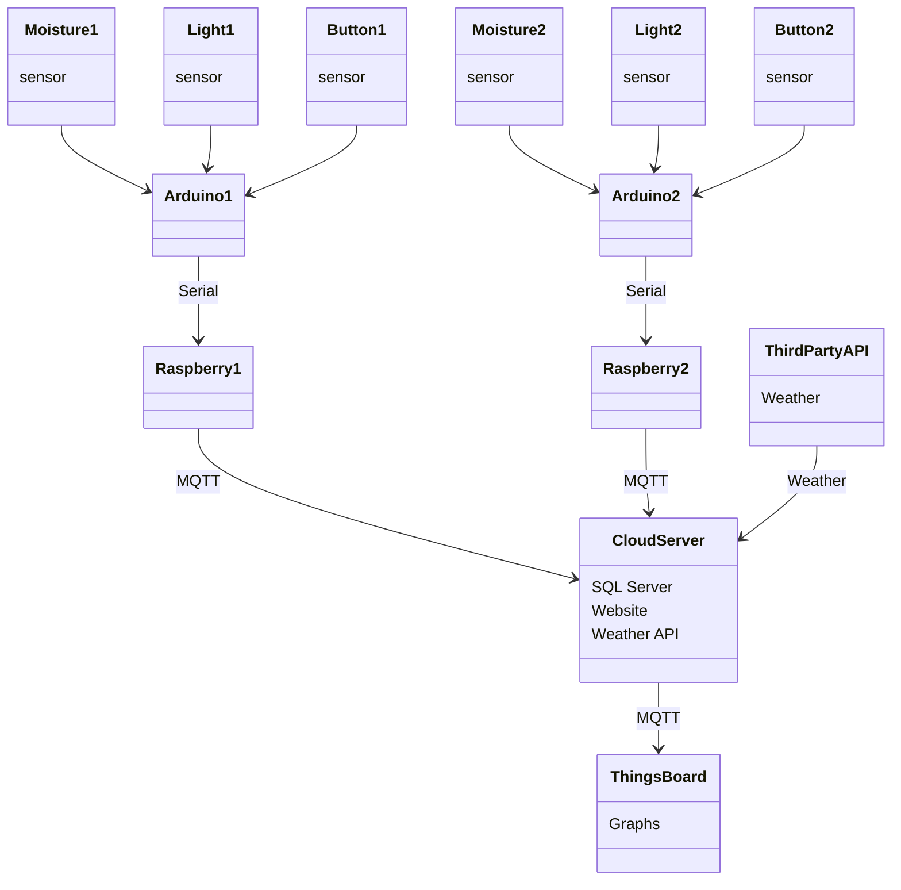
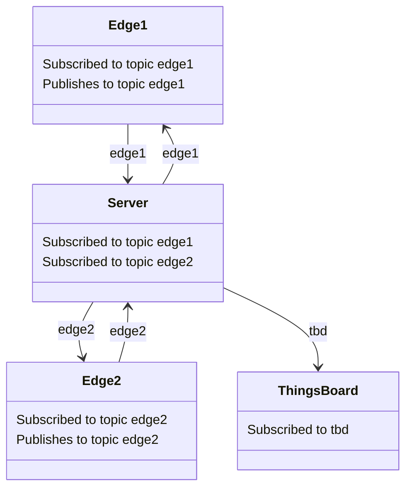

# IOT Group Assignment 

## System Diagram

```mermaid
classDiagram

class ThingsBoard
class Raspberry1
class Raspberry2
class Arduino1
class Arduino2
class CloudServer
class Moisture1
class Moisture2
class Light1
class Light2
class Button1
class Button2
class ThirdPartyAPI

Moisture1 : sensor
Moisture2 : sensor
Light1 : sensor
Light2 : sensor
Button1 : sensor
Button 2 : sensor
CloudServer : SQL Server
CloudServer : Website
CloudServer : Weather API
ThirdPartyAPI : Weather
ThingsBoard : Graphs

Moisture1 --> Arduino1
Moisture2 --> Arduino2
Light1 --> Arduino1
Light2 --> Arduino2
Button1 --> Arduino1
Button2 --> Arduino2

Arduino1 --> Raspberry1 : Serial
Arduino2 --> Raspberry2 : Serial
Raspberry1 --> CloudServer : MQTT
Raspberry2 --> CloudServer : MQTT
ThirdPartyAPI --> CloudServer : Weather
CloudServer --> ThingsBoard : MQTT

```

## Communication Diagram

```mermaid
classDiagram
class Edge1
class Edge2
class Server
class ThingsBoard

Edge1 --> Server : edge1
Edge2 --> Server : edge2

Server --> Edge1 : edge1
Server --> Edge2 : edge2

Edge1 : Subscribed to topic edge1
Edge2 : Subscribed to topic edge2

Server : Subscribed to topic edge1
Server : Subscribed to topic edge2

Edge1 : Publishes to topic edge1
Edge2 : Publishes to topic edge2

Server --> ThingsBoard : tbd

ThingsBoard : Subscribed to tbd
```
