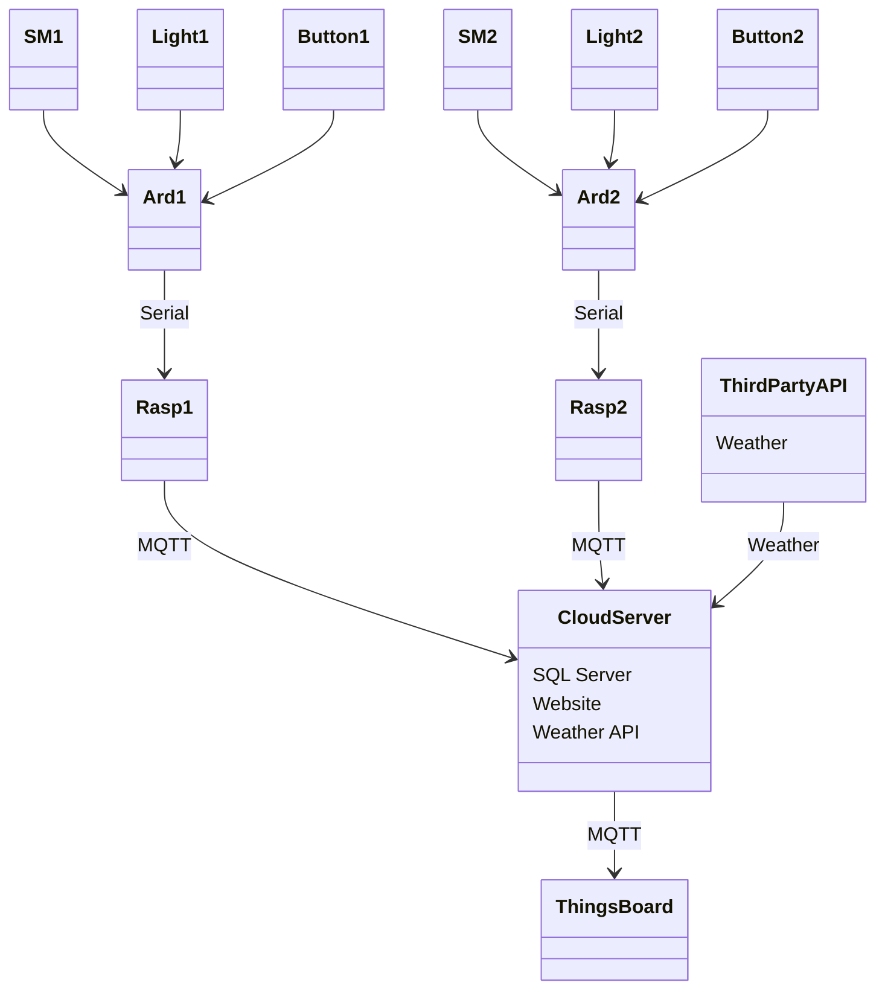

# Assignment 3

```mermaid
classDiagram

class ThingsBoard
class Rasp1
class Rasp2
class Ard1
class Ard2
class CloudServer
class SM1
class SM2
class Light1
class Light2
class Button1
class Button2
class ThirdPartyAPI

SM1 --> Ard1
SM2 --> Ard2
Light1 --> Ard1
Light2 --> Ard2
Button1 --> Ard1
Button2 --> Ard2

Ard1 --> Rasp1 : Serial
Ard2 --> Rasp2 : Serial
Rasp1 --> CloudServer : MQTT
Rasp2 --> CloudServer : MQTT
CloudServer : SQL Server
CloudServer : Website
CloudServer : Weather API
ThirdPartyAPI --> CloudServer : Weather
ThirdPartyAPI : Weather
CloudServer --> ThingsBoard : MQTT

```
