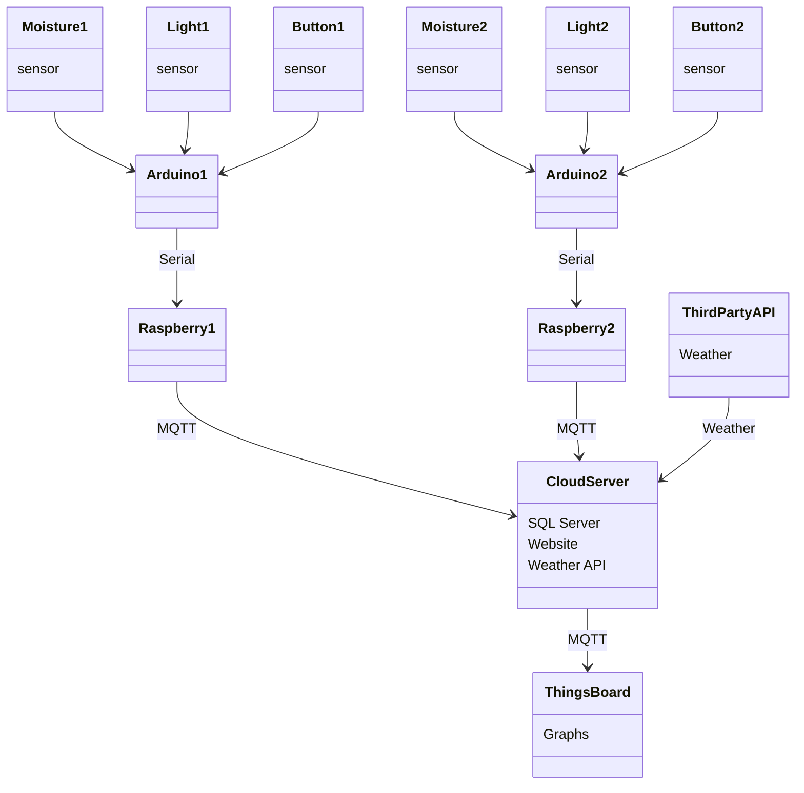
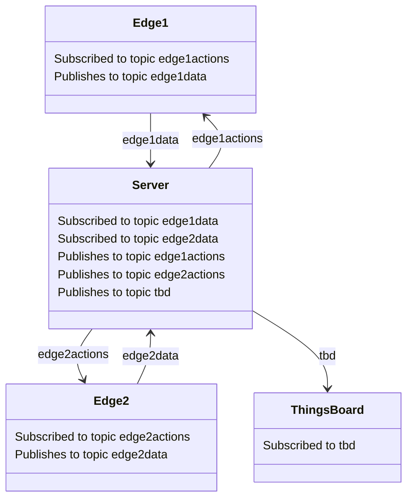
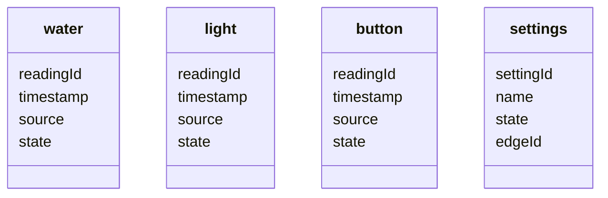
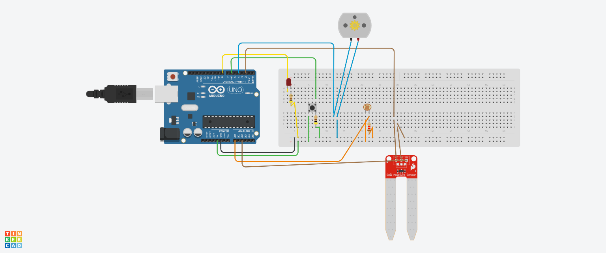
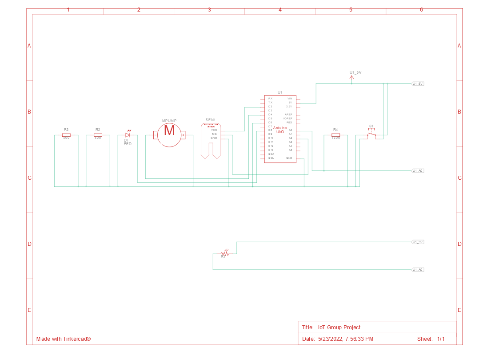
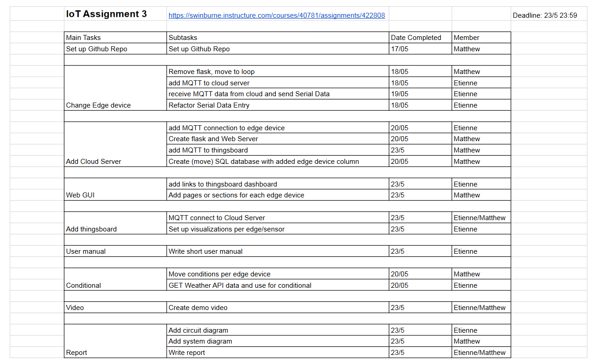

# Application of IoT to Watering System for Plants  

**Etienne Bovet 103168804**  
**Matthew Hulme 103112063**  
**25th April 2022**  
**Demo: !!! ADD LINK HERE !!!**  

!!! DO TABLE OF CONTENTS BEFORE SUBMIT !!!

## Summary

 Plants are an essential part of human life. Therefore, most people enjoy having plants at home. An automated system of watering plants will help people in their daily activities by reducing or completely replacing their effort. This is especially important and convenient for modern life nowadays when people are more and more often out of home to travel around the world for both work and leisure. 

The manual process of watering requires two important aspects to be considered: when and how much to water. In order to replace manual activities, the project builds an IOT device that can initiate the watering of the plant system automatically whenever the moisture content in the pot drops below a threshold value, which will help the plants to reach their fullest potential. Light level monitoring is also used to keep track of the plant as well as conserve water. This work is to make a cheap automatic plant watering system by connecting certain available electronic components and other materials required. Although the system made in that way would be the most appropriate for home plants, there may be a wide possibility of implementing these systems in outdoor gardens. 

For implementation, Arduino UNO and sensors such as moisture sensors and Photoresistor  will be used. The system will be connected through USB and serial communication from the edge device to the Arduino Microcontroller at the plants. This Arduino unit will handle sensor information, trigger actuators, and transmit data to the edge device. The edge device will handle the logic and GUI. A cloud server manages multiple edge devices and provides data visualization with a thingsboard dashboard. With this information, and a switch, the unit will be able to water plants when they need it and when not in full sun.

## System Diagrams

### Overview

### Communication

### Topics

| edge#actions | edge#data |
| ------- | ---- |
| pump | watered |
| led | button |
| | water_level |
| | light_level |

### Database

### Wiring

### Circuit

## Task Breakdown

## Implementation

Data is received from different sensors that are in or around the plan. The data collected from these sensors are sent to the system and based on the sensor details the system will perform the required operations. The automatic plant watering system consists of four main systems. The first is an Arduino UNO IoT node consisting of 2 analog sensors, a soil moisture sensor and a photoresistor, 1 digital sensor, a tactile switch, and 2 actuators, a pump and an LED. The second is an edge device, a virtual machine Raspberry Pi which uses a Python program to allow bidirectional communication between both the node and the cloud. Third is a cloud server which houses the logic for the system, runs a web GUI, and communicates to Thingsboard. Below is a list of hardware and software used in this project

### Hardware

- SparkFun Soil Moisture Sensor - SEN-13637  

- Photoresistor - SEN-09088

- Mute Sounds Mini Submersible Pump  - CE05345

- Arduino UNO

- Tactile Switch

- LED

### Software

- Arduino IDE (C++)

- Python Flask

- SQLite

- Raspberry Pi OS

- VM VirtualBox

- Open-Meteo API

- MQTT

- Thingsboard

### Hardware Requirement

#### Arduino

Arduino Uno is a microcontroller board with many features. Useful to this project are numerous digital input/output pins, several analog input pins, a USB connection, and serial communication.

#### Soil Moisture Sensor

The soil moisture sensor is used to measure the volumetric content of water. The two probes allow the current to pass through the soil and then measure the resistance based on the moisture level. As the water increases, the soil will conduct more electricity which means that there will be less resistance. The analog reading from this sensor will inform the system when the plant needs to be watered through an analog input pin. The power is provided from a digital pin to reduce corrosion.

#### Photoresistor

The photoresistor reduces its resistance as it is exposed to light. The analog reading from this sensor will allow the system to know what level light the plant is receiving. Additionally, watering the plant when it is not in sunlight will decrease evaporation and wasted water. This sensor is connected to the Arduino through the 5v output pin, the analog input pin, 3 resistors totalling 1.2k Ohms of resistance, and the ground pin.

#### Water Pump

The water pump is an actuator which uses the power received from a digital output pin to pump surrounding water through a tube.

#### Tactile Switch

The tactile switch is read as a digital sensor. When the button is pressed the circuit is completed and the signal is read as HIGH. This gives the user the option to override the automated system and water the plant directly from the plants’ location. One side receives power through the 5v pin, connects to a resistor and then the ground. The other side is connected to a digital input pin to detect when the button is pressed.

#### LED

The LED’s purpose is to notify users when the plant should be watered or, if automated watering is enabled, when the plant is being watered. It is connected to a digital output pin, a resistor, and the ground.

### Software Requirements

#### Arduino IDE

The Arduino Integrated Development Environment (Arduino IDE) was used to write an Arduino sketch and upload it to the Arduino UNO.

#### Python

A Python program was used to house conditional logic to enable automation. Additionally, several libraries were used to extend functionality.

#### Python Flask

Python Flask is used to set up a web server in order to render a web browser based GUI using an HTML template.

#### Python Pyserial

This Python library contains tools to set up serial communication. This enabled the python program to read what the Arduino UNO was sending and convert it into usable data.

#### Python psycopg2 (postgresql)

This python library contains an API for interacting with a postgresql database, which unlike other python SQL APIs doesn't crash when accessed by a multithreaded application like ours.

#### Postgresql

Postgresql is a self-contained structured SQL database program. In this project, it was used to create the data tables as well as handle all of the SQL queries.

#### Raspberry Pi OS Virtual Machine

In order to simulate a separate edge device with a simple Linux environment, a Raspberry Pi OS Virtual Machine was created. It was connected to the Arduino through the USB port.

#### Open-Meteo Weather API

A web API was used to get location based weather data through an HTTP GET request with parameters in the URL.  
https://open-meteo.com/en

#### MQTT

The lightweight messaging protocol MQTT was used to facilitate communication between all of the addressable devices in this project. Additionally, the python library paho-mqtt was used to more easily access MQTT capabilities with python.

#### Thingsboard

Thingsboard is an open source IoT platform which was utilized to provide accurate and realtime data collection and visualization.

## User Manual

### Setup

#### IoT Node

Insert Soil Moisture Sensor into the soil you would like to monitor. Make sure that the light sensor is not covered or blocked. Connect the node to the edge via usb.

#### Edge Device

Start the edge device in the terminal of the edge device:  
sudo python Edge.py [serial device descriptor] [cloud ip address] [edge1 | edge2 | ... ]

#### Cloud Server

Start the program in the terminal on the server:  
sudo python Server.py [number of edge devices] [cloud ip address]

### Features

Realtime data will be available by entering the IP address into your browser.

On the website, the automated watering of your plant can be adjusted by changing the values of required soil moisture based on current soil moisture and forecast rain.
The light level may also be monitored throughout the day.

Data Tracking is also available on a thingsboard dashboard which is accessible via a link on the webpage.
There is the history of light level, soil moisture level, and times the plant has been watered.

A button on both the edge and the server can be used to manually water the plant.

## Limitations

- Requires network access between the Edge and Server for automation and logging to function.

- Water needs to be supplied to the Edge device such that it can pump it to the plant and we don't have any kind of sensor for the water tank level.

- All nodes are assumed to be in the same location, we have not created a field in the database to store more locations for the weather API.

- The edge devices and the server are all assumed to be running GNU/Linux.

## References

1. SARAH AL-MUTLAQ, JOEL_E_B, ELL C 2015, Soil Moisture Sensor Hookup Guide，SparkFun, viewed 20 April 2022, <https://learn.sparkfun.com/tutorials/soil-moisture-sensor-hookup-guide>
