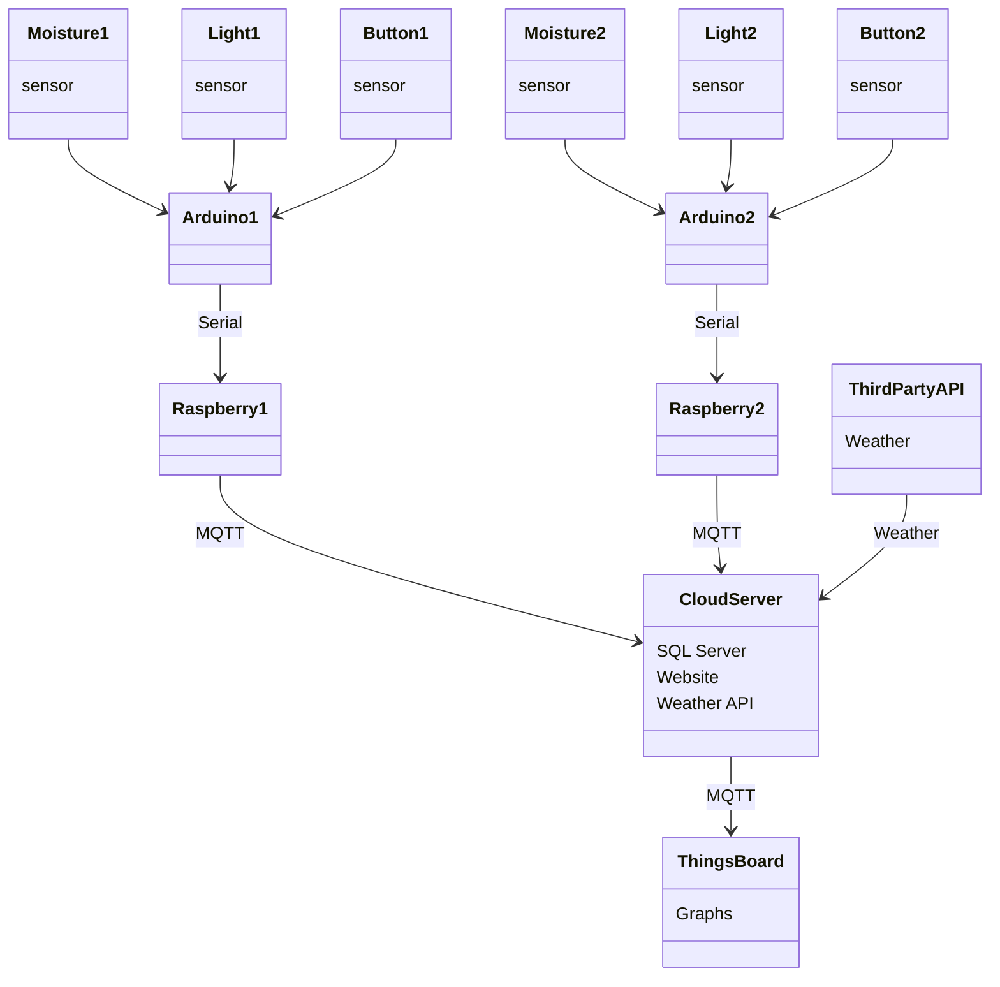
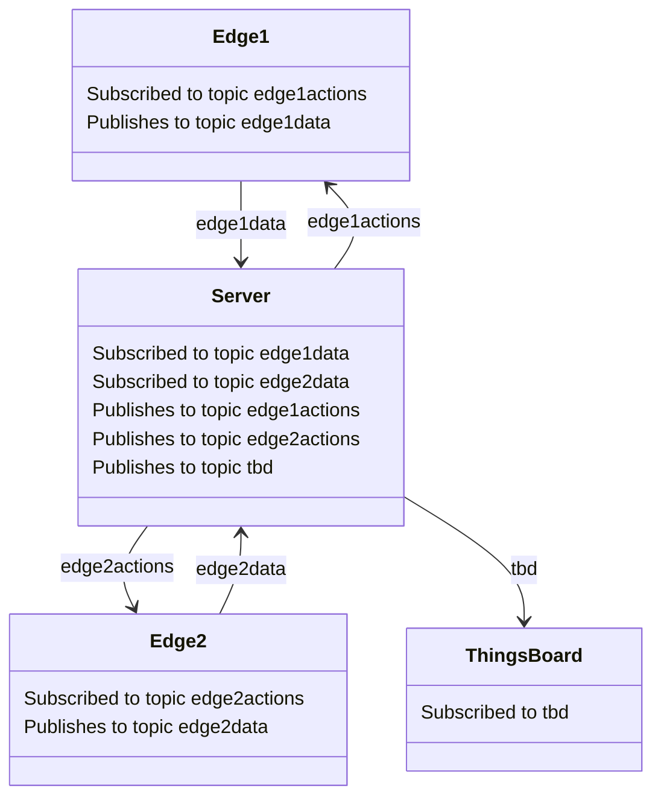
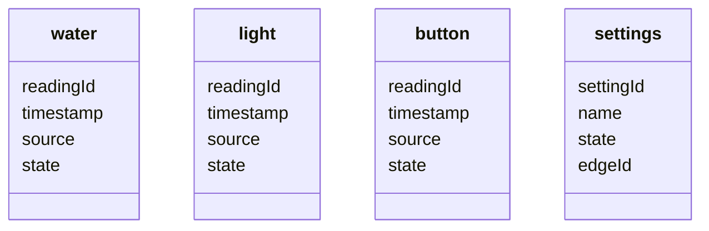

# Application of IoT to Watering System for Plants  

**Etienne Bovet 103168804**  
**Matthew Hulme 103112063**  
**25th April 2022**  
**Demo: https://youtu.be/5cDlGAlzY-c**  

<div style="page-break-after: always;"></div>

## Table of Contents

- **Summary**
- **System Diagrams**
- **Task Breakdown**
- **Implementation**
- **User Manual**
- **Limitations**
- **References**

<div style="page-break-after: always;"></div>

## Summary

 Plants are an essential part of human life. Therefore, most people enjoy having plants at home. An automated system of watering plants will help people in their daily activities by reducing or completely replacing their effort. This is especially important and convenient for modern life nowadays when people are more and more often out of home to travel around the world for both work and leisure. 

The manual process of watering requires two important aspects to be considered: when and how much to water. In order to replace manual activities, the project builds an IOT device that can initiate the watering of the plant system automatically whenever the moisture content in the pot drops below a threshold value, which will help the plants to reach their fullest potential. Light level monitoring is also used to keep track of the plant as well as conserve water. This work is to make a cheap automatic plant watering system by connecting certain available electronic components and other materials required. Although the system made in that way would be the most appropriate for home plants, there may be a wide possibility of implementing these systems in outdoor gardens. 

For implementation, Arduino UNO and sensors such as moisture sensors and Photoresistor  will be used. The system will be connected through USB and serial communication from the edge device to the Arduino Microcontroller at the plants. This Arduino unit will handle sensor information, trigger actuators, and transmit data to the edge device. The edge device will handle the logic and GUI. A cloud server manages multiple edge devices and provides data visualization with a thingsboard dashboard. With this information, and a switch, the unit will be able to water plants when they need it and when not in full sun.

## System Diagrams

### Overview



### Communication



### Topics

| edge#actions | edge#data |
| ------- | ---- |
| pump | watered |
| led | button |
| | water_level |
| | light_level |

### Database



### Wiring


### Circuit


## Task Breakdown


## Implementation


Data is received from different sensors that are in or around the plan. The data collected from these sensors are sent to the system and based on the sensor details the system will perform the required operations. The automatic plant watering system consists of four main systems. The first is an Arduino UNO IoT node consisting of 2 analog sensors, a soil moisture sensor and a photoresistor, 1 digital sensor, a tactile switch, and 2 actuators, a pump and an LED. The second is an edge device, a virtual machine Raspberry Pi which uses a Python program to allow bidirectional communication between both the node and the cloud. Third is a cloud server which houses the logic for the system, runs a web GUI, and communicates to Thingsboard. Below is a list of hardware and software used in this project

### Hardware

- SparkFun Soil Moisture Sensor - SEN-13637  

- Photoresistor - SEN-09088

- Mute Sounds Mini Submersible Pump  - CE05345

- Arduino UNO

- Tactile Switch

- LED

### Software

- Arduino IDE (C++)

- Python Flask

- SQLite

- Raspberry Pi OS

- VM VirtualBox

- Open-Meteo API

- MQTT

- Thingsboard

### Hardware Requirement

#### Arduino

Arduino Uno is a microcontroller board with many features. Useful to this project are numerous digital input/output pins, several analog input pins, a USB connection, and serial communication.

#### Soil Moisture Sensor

The soil moisture sensor is used to measure the volumetric content of water. The two probes allow the current to pass through the soil and then measure the resistance based on the moisture level. As the water increases, the soil will conduct more electricity which means that there will be less resistance. The analog reading from this sensor will inform the system when the plant needs to be watered through an analog input pin. The power is provided from a digital pin to reduce corrosion.

#### Photoresistor

The photoresistor reduces its resistance as it is exposed to light. The analog reading from this sensor will allow the system to know what level light the plant is receiving. Additionally, watering the plant when it is not in sunlight will decrease evaporation and wasted water. This sensor is connected to the Arduino through the 5v output pin, the analog input pin, 3 resistors totalling 1.2k Ohms of resistance, and the ground pin.

#### Water Pump

The water pump is an actuator which uses the power received from a digital output pin to pump surrounding water through a tube.

#### Tactile Switch

The tactile switch is read as a digital sensor. When the button is pressed the circuit is completed and the signal is read as HIGH. This gives the user the option to override the automated system and water the plant directly from the plants’ location. One side receives power through the 5v pin, connects to a resistor and then the ground. The other side is connected to a digital input pin to detect when the button is pressed.

#### LED

The LED’s purpose is to notify users when the plant should be watered or, if automated watering is enabled, when the plant is being watered. It is connected to a digital output pin, a resistor, and the ground.

### Software Requirements

#### Arduino IDE

The Arduino Integrated Development Environment (Arduino IDE) was used to write an Arduino sketch and upload it to the Arduino UNO.

#### Python

A Python program was used to house conditional logic to enable automation. Additionally, several libraries were used to extend functionality.

#### Python Flask

Python Flask is used to set up a web server in order to render a web browser based GUI using an HTML template.

#### Python Pyserial

This Python library contains tools to set up serial communication. This enabled the python program to read what the Arduino UNO was sending and convert it into usable data.

#### Python psycopg2 (postgresql)

This python library contains an API for interacting with a postgresql database, which unlike other python SQL APIs doesn't crash when accessed by a multithreaded application like ours.

#### Postgresql

Postgresql is a self-contained structured SQL database program. In this project, it was used to create the data tables as well as handle all of the SQL queries.

#### Raspberry Pi OS Virtual Machine

In order to simulate a separate edge device with a simple Linux environment, a Raspberry Pi OS Virtual Machine was created. It was connected to the Arduino through the USB port.

#### Open-Meteo Weather API

A web API was used to get location based weather data through an HTTP GET request with parameters in the URL.  
https://open-meteo.com/en

#### MQTT

The lightweight messaging protocol MQTT was used to facilitate communication between all of the addressable devices in this project. Additionally, the python library paho-mqtt was used to more easily access MQTT capabilities with python.

#### Thingsboard

Thingsboard is an open source IoT platform which was utilized to provide accurate and realtime data collection and visualization.

## User Manual

### Setup

#### IoT Node

Insert Soil Moisture Sensor into the soil you would like to monitor. Make sure that the light sensor is not covered or blocked. Connect the node to the edge via usb.

#### Edge Device

Start the edge device in the terminal of the edge device:  
sudo python Edge.py [serial device descriptor] [cloud ip address] [edge1 | edge2 | ... ]

#### Cloud Server

Start the program in the terminal on the server:  
sudo python Server.py [number of edge devices] [cloud ip address]

### Features

Realtime data will be available by entering the IP address into your browser.

On the website, the automated watering of your plant can be adjusted by changing the values of required soil moisture based on current soil moisture and forecast rain.
The light level may also be monitored throughout the day.

Data Tracking is also available on a thingsboard dashboard which is accessible via a link on the webpage.
There is the history of light level, soil moisture level, and times the plant has been watered.

A button on both the edge and the server can be used to manually water the plant.

## Limitations

- Requires network access between the Edge and Server for automation and logging to function.

- Water needs to be supplied to the Edge device such that it can pump it to the plant and we don't have any kind of sensor for the water tank level.

- All nodes are assumed to be in the same location, we have not created a field in the database to store more locations for the weather API.

- The edge devices and the server are all assumed to be running GNU/Linux.

## References

1. SARAH AL-MUTLAQ, JOEL_E_B, ELL C 2015, Soil Moisture Sensor Hookup Guide，SparkFun, viewed 20 April 2022, <https://learn.sparkfun.com/tutorials/soil-moisture-sensor-hookup-guide>

## Appendix

### watering_system.ino

```c
/*  IOT Individual Practical Assignment 
 *   Etienne Bovet 103168804
*/
const int buttonPin = 6;
int buttonState;

int lastButtonState = LOW;

unsigned long lastDebounceTime = 0;  // the last time the output pin was toggled
unsigned long debounceDelay = 50;    // the debounce time; increase if the output flickers

float soilVal = 0; //value for storing moisture value
float lightVal = 0;
const int lightPin = A0;
const int soilPin = A2;
const int soilPower = 2;//Soil Moisture Sensor Power
const int pumpPower = 4;
const int ledPower = 8;

bool shouldPump = false;
bool buttonPressed = false;
bool shouldFlash = false;

void setup() 
{
  Serial.begin(9600);   // open serial

  pinMode(buttonPin, INPUT);
  //  Set Digital power pins as output and initialized as off
  pinMode(soilPower, OUTPUT);
  pinMode(pumpPower, OUTPUT);
  pinMode(ledPower, OUTPUT);
  digitalWrite(soilPower, LOW);
  digitalWrite(pumpPower, LOW);
}

void loop() 
{

  //Check if there is serial input data available 
   while (Serial.available()>0)
   {
      //Read serial input
      int value = Serial.read();
      if (value == '1')
      {
        shouldPump = true;
      }
      if (value == '2')
      {
        shouldFlash = true;
      }
   }
  int reading = digitalRead(buttonPin);
  if (reading != lastButtonState) 
  {
    // reset the debouncing timer
    lastDebounceTime = millis();
  }
  if ((millis() - lastDebounceTime) > debounceDelay) 
  {
    // whatever the reading is at, it's been there for longer
    // than the debounce delay, so take it as the actual current state:

    // if the button state has changed:
    buttonState = reading;
    if (buttonState == HIGH) 
    {
      buttonPressed = true;
      shouldPump = true;
      digitalWrite(pumpPower, LOW);
    }
  }
  
  lastButtonState = reading;
  
  soilVal = (readSoil())/900*100; //Value in percent of max
  lightVal = (readLight())/1030*100; //Value in percent of max
  
  
  //Rate of sensor readings
  delay(5000);

  serialPrint();
  activatePump();
  flashLED();

  buttonPressed = false;
  shouldPump = false;
  shouldFlash = false;

}

float readSoil()
{

    digitalWrite(soilPower, HIGH);
    delay(10);//wait 10 milliseconds 
    soilVal = analogRead(soilPin);
    digitalWrite(soilPower, LOW);
    return soilVal;
}

float readLight()
{
    lightVal = analogRead(lightPin);//Read the SIG value form sensor 
    return lightVal;
}

void serialPrint()
{
  if(shouldPump)
  {
     Serial.println("watered = 1");
  }
  else
  {
     Serial.println("watered = 0");
  }
  if(buttonPressed)
  {
     Serial.println("button = 1");
  }
  else
  {
     Serial.println("button = 0");
  }
  Serial.print("water_level = ");
  Serial.println(soilVal);
  Serial.print("light_level = ");
  Serial.println(lightVal);
}

void flashLED()
{
  if(shouldFlash)
  {
    digitalWrite(ledPower, HIGH);
    delay(1000);
    digitalWrite(ledPower, LOW);
  }
}

void activatePump()
{
  if(shouldPump)
  {
    digitalWrite(pumpPower, HIGH);
    delay(2000);
    digitalWrite(pumpPower, LOW);
  }
}


```

### Edge.py

```python
# arg 1 : serial device
# arg 2 : cloud server address
# arg 3 : edge name

# CLI arguments
import sys
# MQTT for communication with the server.
import paho.mqtt.publish as mqttpublish
import paho.mqtt.client as mqttclient

import serial
import time

#no longer using this dict
node1 = {"watered": 0,
        "button": 0,
        "water_level": 0,
        "light_level": 0,
        "time_record": 0,
        "last_update": 0}

#cloud subscription, edge does need to know which one it is
def on_connect(client, userdata, flags, rc):
    print("Connected with result code " + str(rc))
    #arg 3 is edge id
    client.subscribe(sys.argv[3] + "actions/#")

#topics are pump and led
#send serial instructions to node for pump or led
def on_message(client, userdata, msg):
    if (msg.topic == (sys.argv[3] + "actions/pump")):
        print("pump")
        userdata['ser'].write(b"1")
    if (msg.topic == (sys.argv[3] + "actions/led")):
        userdata['ser'].write(b"2")
        print ("led")

#hostname is sender ip
def sendData(topic, message):
    hostip = sys.argv[2]
    print(topic + " " + message)
    mqttpublish.single(topic, message, hostname=hostip)

def serialDataFiltering(text):

    #the string without node1/
    key = text[0]
    #Watered might not need to be here
    if (
            key == "watered" or
            key == "button" or
            key == "water_level" or
            key == "light_level"
        ):
        #send the correct node's data directly
        topic = sys.argv[3] + "data/" + key
        sendData(topic, text[1])

def main():
    # Grab serial device (argument 1)
    ser = serial.Serial(sys.argv[1], 9600, timeout = 10)
    ser.flush()
    
    #pass serial as user data
    client_userdata = {'ser':ser}
    client = mqttclient.Client(userdata=client_userdata)
    client.on_connect = on_connect
    client.connect(sys.argv[2], 1883, 60)
    #non-blocking loop (runs on background thread)
    client.loop_start()

    while(True):
        # Read serial data if there is data in the buffer and send it.
        while(ser.in_waiting > 0):
            #change from do 4 times to for every line in serial
            text = ser.readline().decode('utf-8').strip().split(" = ")
            #data coming in will have node name in front (ex: node1/)
            serialDataFiltering(text)

    # Receive MQTT signal to turn pump/LED on and off.
    # (ser.write(b"2"))
        
        client.on_message = on_message

if __name__ == '__main__':
    # Thank you Mario!
    # But our main() is in another castle. 
    while(1):
        main()
        # Wait a bit before restarting the loop.
        delay(2)

```

### Server.py

```python
# IOT Assignment RPI python script
# arg 1 : serial device file

#import serial
import time
from datetime import datetime
# postgresql
import psycopg2
#import thread
# CLI arguments
import sys
# regex
#import re
# Floating point logic is complete garbage so I'm trying Decimal.
from decimal import Decimal
# Flask for webpage
from flask import Flask, render_template
# MQTT for communication with ThingsBoard and both Nodes.
import paho.mqtt.publish as mqttpublish
import paho.mqtt.client as mqttclient
# Required for weather.
import requests
import json
# pdb debugger
#import pdb; pdb.set_trace()


# Flask init.
app = Flask(__name__)

# Global constants
EDGE_COUNT=int(sys.argv[1])
HOSTNAME=sys.argv[2]
EDGE_NUMBERING_OFFSET = 1
WEATHER_URL = "https://api.open-meteo.com/v1/forecast?latitude=-37.840&longitude=144.946&daily=precipitation_sum&timezone=Australia%2FSydney"
ACCESS_TOKEN = '7JXPZYpKiPk3gLl8wyhM'
THINGSBOARD_ADDRESS = 'thingsboard.cloud'


# Brains of the Flask website.
class SiteLogic:
	# Generic function for executing queries that
	#+don't require much any extra interaction.
	def __execQuery(self, query):
		# !!! DEBUG !!!
		#print(query)
		rows = None
		
		with self.__conn:
			cursor = self.__conn.cursor()
			cursor.execute(query)
			# Sometimes this will complain that there are no rows, ignore it.
			try:
				rows = cursor.fetchall()
			except:
				pass
			self.__conn.commit()
			cursor.close()
		
		return rows
			

	# siteLogic constructor
	def __init__(self, persist):
		# SQL connection
		self.__conn = psycopg2.connect(
			database="pi",
			user = "pi",
			password = "pi",
			host = "127.0.0.1",
			port = "5432")
		
		# MOISTURE
		# Clear old database entries.
		if not (persist):
			self.__execQuery("DROP TABLE IF EXISTS moisture;")

		self.__execQuery(
			"CREATE TABLE IF NOT EXISTS moisture(" +
			"readingId SERIAL PRIMARY KEY NOT NULL, " +
			"timestamp VARCHAR(20) NOT NULL," +
			"source VARCHAR(20) NOT NULL," +
			"state DECIMAL NOT NULL);"
		)

		# LIGHT
		# Clear old database entries.
		if not (persist):
			self.__execQuery("DROP TABLE IF EXISTS light;")

		self.__execQuery(
			"CREATE TABLE IF NOT EXISTS light("
			"readingId SERIAL PRIMARY KEY NOT NULL, " +
			"timestamp VARCHAR(20) NOT NULL," +
			"source VARCHAR(20) NOT NULL," +
			"state DECIMAL NOT NULL);"
		)

		# BUTTON
		# Clear old database entries.
		if not (persist):
			self.__execQuery("DROP TABLE IF EXISTS button;")

		self.__execQuery(
			"CREATE TABLE IF NOT EXISTS button("
			"readingId SERIAL PRIMARY KEY NOT NULL, " +
			"timestamp VARCHAR(20) NOT NULL," +
			"source VARCHAR(20) NOT NULL," +
			"state BOOLEAN NOT NULL);"
		)

		# Settings table.
		# Always drop.
		#if not (persist):
		self.__execQuery("DROP TABLE IF EXISTS settings;")

		self.__execQuery(
			"CREATE TABLE IF NOT EXISTS settings" +
			"(settingId SERIAL PRIMARY KEY NOT NULL, "
			"name VARCHAR(22) NOT NULL, " +
			"state VARCHAR(22) NOT NULL,"
			"edgeId VARCHAR(22));"
		)

		# Go get the latest weather.
		self.updateAPIWeather()

	def initMQTT(self):
		global EDGE_NUMBERING_OFFSET
		global HOSTNAME
		global EDGE_COUNT
		# MQTT Client initializaiton.
		self.__client = []
		# argv[0] : this file
		# argv[1] : ammount of instances
		# argv[2] : ip address of this computer
		# Add a client for every IP passed as an argument.
		for i in range(int(EDGE_COUNT)):
			# User userdata as the index for if we don't know which client is
			#+calling a function.
			self.__client.append(
				mqttclient.Client(userdata=str(i + EDGE_NUMBERING_OFFSET))
			)
			#print("Creating MQTT client instance " + str(i))
			self.__client[i].on_connect = on_connect
			self.__client[i].on_message = on_message

			# Initialize MQTT connection.
			port = 1883
			#print("Attempting to connect on " + HOSTNAME + ":" + str(port))
			# args: host, port, keepalive
			self.__client[i].connect(HOSTNAME, port, 60)

		# Start MQTT loop(s).
		for i in range(len(self.__client)):
			#print("Starting loop " + str(self.__client[i]))
			self.__client[i].loop_start()
		
		# Little sanity check.
		assert len(self.__client) == EDGE_COUNT
				
		# Set defaults for settings table.
		# This is done here since we don't know how many edge devices there are
		#+up until this point.
		for i in range(EDGE_COUNT):
			j = i + EDGE_NUMBERING_OFFSET
			'''
			with self.__conn:
				cursor = self.__conn.cursor()
				#This is wrapped in a try because it will fail when
				#+persistence is turned on and we don't really care as long as
                #+it exists.
				try:
					# Changes what number we start counting from.
					cursor.execute(
						"INSERT INTO settings (name, state, edgeId) " +
						"VALUES('target_moisture', '0', '" + j + "');"
					)
					self.__conn.commit()
				except:
					pass
				cursor.close()
			'''
			self.__execQuery(
				"INSERT INTO settings (name, state, edgeId) " +
				"VALUES('target_moisture', '0', '" + str(j) + "');"
			)
			self.__execQuery(
				"INSERT INTO settings (name, state, edgeId) " +
				"VALUES('target_light', '50', '" + str(j) + "');"
			)
			self.__execQuery(
				"INSERT INTO settings (name, state, edgeId) " +
				"VALUES('target_rain', '0', '" + str(j) + "');"
			)
			

		self.__tbClient = mqttclient.Client("ThingsBoard")
		self.__tbClient.username_pw_set(ACCESS_TOKEN)
		self.__tbClient.connect(THINGSBOARD_ADDRESS, 1883, 60) 

		#print("mqtt init loop complete")

	# Time getter
	def getTime(self):
		return datetime.now().strftime("%H:%M:%S")

	# Getter for DB moisture target.
	def getDBTargetMoistById(self, edgeId):
		return self.__execQuery(
			"SELECT state FROM settings " +
			"WHERE name='target_moisture' " +
			"AND edgeId='" + str(edgeId) + "';"
		)[0][0]
	def getDBTargetMoist(self):
		return self.__execQuery(
			"SELECT state, edgeId FROM settings " +
			"WHERE name='target_moisture' " +
			"ORDER BY edgeId;"
		)

	# Setter for DB moisture target.
	def setDBTargetMoist(self, edgeId, state):
		self.__execQuery(
			"UPDATE settings SET " +
			"state='" + str(state) + "' " +
			"WHERE name='target_moisture' " +
			"AND edgeId='" + str(edgeId) + "';"
		)

	# Getter for DB rain target.
	def getDBTargetRainById(self, edgeId):
		return self.__execQuery(
			"SELECT state FROM settings " +
			"WHERE name='target_rain' " +
			"AND edgeId='" + str(edgeId) + "';"
		)[0][0]

	# Getter for DB rain targets.
	def getDBTargetRain(self):
		return self.__execQuery(
			"SELECT state, edgeId FROM settings " +
			"WHERE name='target_rain' " +
			"ORDER BY edgeId;"
		)

	# Setter for DB rain target.
	def setDBTargetRain(self, edgeId, state):
		self.__execQuery(
			"UPDATE settings SET " +
			"state='" + str(state) + "' " +
			"WHERE name='target_rain' " +
			"AND edgeId='" + str(edgeId) + "';"
		)

	# Getter for DB light target
	def getDBTargetLightById(self, edgeId):
		return self.__execQuery(
			"SELECT state FROM settings " +
			"WHERE name='target_light' " +
			"AND edgeId='" + str(edgeId) + "';"
		)[0][0]
	def getDBTargetLight(self):
		return self.__execQuery(
			"SELECT state, edgeId FROM settings " +
			"WHERE name='target_light' " +
			"ORDER BY edgeId;"
		)
 
	# Setter for DB light target.
	def setDBTargetLight(self, edgeId, state):
		self.__execQuery(
			"UPDATE settings SET " +
			"state='" + str(state) + "' " +
			"WHERE name='target_light' " +
			"AND edgeId='" + str(edgeId) + "';"
		)

	# Setter for DB moisture readings.
	def setDBMoisture(self, source, state):
		self.__execQuery(
			"INSERT INTO moisture (timestamp, source, state) VALUES('" +
			self.getTime() + "', '" +
			str(source) + "', '" +
			str(state) + "');"
		)
	
	# Setter for DB light readings.
	def setDBLight(self, source, state):
		self.__execQuery(
			"INSERT INTO light (timestamp, source, state) VALUES('" +
			self.getTime() + "', '" +
			str(source) + "', '" +
			str(state) + "');"
		)

	# Setter for DB moisture readings.
	def setDBButton(self, source, state):
		self.__execQuery(
			"INSERT INTO button (timestamp, source, state) VALUES('" +
			self.getTime() + "', '" +
			str(source) + "', '" +
			str(state) + "');"
		)

	# Getter for most recent DB moisture reading.
	def getDBMoisture(self):
		# Buffer result.
		return self.__execQuery(
			"SELECT s.readingId, s.state, s.source " +
			"FROM moisture s " +
			"JOIN (SELECT MAX(readingId) AS id " +
			"FROM moisture " +
			"GROUP BY source) max " +
			"ON s.readingId = max.id " +
			"ORDER BY s.source;"
		)

	# Getter for most recent DB light reading.
	def getDBLight(self):
		return self.__execQuery(
			"SELECT s.readingId, s.state, s.source " +
			"FROM light s " +
			"JOIN (SELECT MAX(readingId) AS id " +
			"FROM light " +
			"GROUP BY source) max " +
			"ON s.readingId = max.id " +
			"ORDER BY s.source;"
		)

	# Getter for most recent # DB moisture readings.
	def getDBRecMoist(self, ammount):
		return self.__execQuery(
			"SELECT timestamp, source, state FROM moisture " +
			"ORDER BY readingId DESC LIMIT " + str(ammount) + ";"
		)
	
	# Getter for most recent # DB light readings.
	def getDBRecLight(self, ammount):
		return self.__execQuery(
			"SELECT timestamp, source, state FROM light " +
			"ORDER BY readingId DESC LIMIT " + str(ammount) + ";"
		)

	# Getter for average of last # DB moisture readings.
	def getDBAveMoist(self, ammount):
		return self.__execQuery(
			"SELECT AVG(state) FROM moisture " +
			"GROUP BY state LIMIT " + str(ammount) + ";"
		)[0]
	
	def getDBAveMoistById(self, source, ammount):
		return self.__execQuery(
			"SELECT AVG(state) " +
			"FROM moisture "
			"WHERE source='" + str(source) + "' " +
			"LIMIT " + str(ammount) + ";"
		)

	def getDBAveLightById(self, source, ammount):
		return self.__execQuery(
			"SELECT AVG(state) " +
			"FROM light "
			"WHERE source='" + str(source) + "' " +
			"LIMIT " + str(ammount) + ";"
		)[0][0]

	# Getter for average of last # DB light readings.
	def getDBAveLight(self, ammount):
		return self.__execQuery(
			"SELECT AVG(state) FROM light " +
			"GROUP BY state LIMIT " + str(ammount) + ";"
		)[0]
	
	# Template data getter
	# I am aware that using separate functions to make multiple
	#+SQL queries is inefficient but this doesn't need to be perfect.
	def getTemplateData(self):
		return {
			'time' : self.getTime(),
			'moisture' : self.getDBMoisture(),
			'light' : self.getDBLight(),
			'moisttarget' : self.getDBTargetMoist(),
			'lighttarget' : self.getDBTargetLight(),
			'recentmoist' : self.getDBRecMoist(10),
			'recentlight' : self.getDBRecLight(10),
			'weather' : self.getAPIWeatherRain(),
			'raintarget' : self.getDBTargetRain()
		}
	
	# Fetch new weather data.
	def updateAPIWeather(self):
		global WEATHER_URL

		self.request = requests.get(WEATHER_URL, timeout=5)
		self.weather = json.loads(self.request.content)

	# Returns an array where rain[0] is today's rain in mm and rain[1] is
	#+tomorrow etc.
	def getAPIWeatherRain(self):
		return self.weather['daily']['precipitation_sum']
	
	# Supply water to the specified plant.
	def supplyWater(self, client):
		global HOSTNAME
		topic = "edge" + str(client) + "actions/pump"
		payload = "THIS IS IGNORED."
		# !!! DEBUG MESSAGE !!!
		print("Topic: " + topic + " | Payload: " + payload)
		mqttpublish.single(topic, payload, hostname=HOSTNAME)

	def sendMQTTThingsBoard(self, data):
		#print("DEBUG inside")
		#print(data)
		#print(json.dumps(data))
		self.__tbClient.publish("v1/devices/me/telemetry", json.dumps(data))


# Function bound to pahoMQTT
# thisclient : ?
# userdata : ?
# flags : ?
# rc : Result code
def on_connect(thisclient, userdata, flags, rc):
	global sl
	print("Connected with result code: " + str(rc))
	# Subscribe to edge[number]data/#
	# # : denotes wildcard
	topic = "edge" + str(userdata) + "data/#"
	# Resub here so it doesn't lose subscriptions on reconnect.
	print("Attempting subscription to " + topic + ".")
	thisclient.subscribe(topic)
	print("Subscribed.")

# Function bound to pahoMQTT
# thisclient : ?
# userdata : ?
# message : The message that was received.
def on_message(thisclient, userdata, message):
	global sl

	# Create an array of the topic sections.
	topicSplit = message.topic.split("/")

	# Get 5th character of first section of topic.
	#
	# edge#data
	#     ^
	# 012345678
	#
	# This is the number of the edge device.
	# This number may not correspond to the index it is stored at on this end.
	source = topicSplit[0][4]

	# !!! DEBUG CODE !!!
	# Debug code to display messages as they're received.
	'''
	print("")
	print("DEBUG on_message debug info")
	print("message.topic : " + str(message.topic))
	print("message.payload : " + str(message.payload))
	print("topicSplit[0] : " + str(topicSplit[0]))
	print("topicSplit[1] : " + str(topicSplit[1]))
	print("source : " + str(source))
	'''

	# Check what the topic is, store information in that table.
	# Sadly match - case was introduced in a later version of python.
	if(topicSplit[1] == "water_level"):
		#print("Logging moisture : " + message.payload)
		sl.setDBMoisture(source, message.payload)

	print("1")

	if(topicSplit[1] == "light_level"):
		#print("Logging light level : " + message.payload)
		sl.setDBLight(source, message.payload)

	print("2")

	if(topicSplit[1] == "button"):
		#print("Logging button press : " + message.payload)
		sl.setDBButton(source, message.payload)

	print("3")

	needsWater = False
	willRain = False
	tooSunny = False
	# Check if the plant needs water.
	if(sl.getDBAveMoistById(source, 20) < sl.getDBTargetMoistById(source)):
		needsWater = True

	print("4")

	# Check if there will be enough water today to water the plant.
	if(sl.getAPIWeatherRain()[0] > sl.getDBTargetRainById(source)):
		willRain = True

	print("5")

	#print(sl.getDBAveLightById(source))

    # Check if it's too sunny to bother with watering the plants.
	print(source)
	print("getDBAveLightById")
	print(sl.getDBAveLightById(source, 20))
	print("getDBTargetLightById")
	print(sl.getDBTargetLightById(source))

	if( Decimal(sl.getDBAveLightById(source, 20)) >
		Decimal(sl.getDBTargetLightById(source))):
		tooSunny = True

	print("6")

	print(needsWater)
	print(willRain)
	print(tooSunny)
	print(needsWater == True and willRain == False and tooSunny == False)

	# Supply water if needed.
	if(needsWater == True and willRain == False and tooSunny == False):
		sl.supplyWater(source)

	# !!! DEBUG CODE !!!
	#sl.supplyWater(source)
	# !!! END DEBUG CODE !!!

	# Send data to ThingsBoard.
	data = {}
	#print("Populate: dict data")
	data[message.topic] = message.payload
	if(needsWater):
		data["watered"] = "0"
	else:
		data["watered"] = "1"

	# Check if the button was pressed and assume watered if it was since that's
	#+what the button does.
	if(topicSplit[1] == "button"):
		data["watered"] = str(message.payload)

	# Send data onward to ThingsBoard.
	sl.sendMQTTThingsBoard(data)


@app.route("/pumpbutton/<source>")
def pumpButton(source):
	global sl
	sl.supplyWater(source)
	templateData = sl.getTemplateData()
	return render_template('index.html', **templateData)

# index.html file operation
@app.route("/")
def index():
	global sl
	# This data will be sent to index.html
	templateData = sl.getTemplateData()
	return render_template('index.html', **templateData)

# Increment/decrement the specified target.
@app.route("/<targetName>/<edgeId>/<direction>")
def adjustTarget(targetName, edgeId, direction):
	global sl
	newVal = 0
	# Adjust moisture.
	if (targetName == 'moisture'):
		if(direction == 'up'):
			newVal = Decimal(sl.getDBTargetMoistById(edgeId)) + Decimal(1.00)
		else:
			newVal = Decimal(sl.getDBTargetMoistById(edgeId)) - Decimal(1.00)
		
		sl.setDBTargetMoist(edgeId, newVal)

	# Adjust light.
	if (targetName == 'light'):
		if(direction == 'up'):
			newVal = Decimal(sl.getDBTargetLightById(edgeId)) + Decimal(1.00)
		else:
			newVal = Decimal(sl.getDBTargetLightById(edgeId)) - Decimal(1.00)
	
		sl.setDBTargetLight(edgeId, newVal)

	# Adjust rain.
	if (targetName == 'rain'):
		if(direction == 'up'):
			newVal = Decimal(sl.getDBTargetRainById(edgeId)) + Decimal(1.00)
		else:
			newVal = Decimal(sl.getDBTargetRainById(edgeId)) - Decimal(1.00)

		sl.setDBTargetRain(edgeId, newVal)

	templateData = sl.getTemplateData()
	return render_template('index.html', **templateData)


def main():
	global sl
	# Set argument to true if you would like to retain existing data in table.
	sl = SiteLogic(False)
	# Setup MQTT, which relies on sl being defined first.
	sl.initMQTT()

	# This delay is here so init messages don't get mixed up with flask ones.
	time.sleep(3)

	# Start flask.
	app.run(
		host = '0.0.0.0',
		port = 80,
		debug = True,
		threaded = False,
		use_reloader=False
	)


if __name__ == '__main__':
	# Thank you Mario!
	# But our main() is in another castle. 
	main()


'''
# MQTT example code

import paho.mqtt.client as mqtt
import time
import json

ACCESS_TOKEN = '7JXPZYpKiPk3gLl8wyhM'
THINGSBOARD_ADDRESS = 'thingsboard.cloud'

client = mqtt.Client()

client.username_pw_set(ACCESS_TOKEN)
client.connect(THINGSBOARD_ADDRESS, 1883, 60)
client.loop_start()
data = {}
data['water_level'] = 7

while(True):
	client.publish("v1/devices/me/telemetry", json.dumps(data))
	time.sleep(5)

'''

```

### index.html

```html
<!DOCTYPE html>
	<head>
		<title>IOT Group Assignment - {{ time }}</title>
		<meta http-equiv="refresh" content="1;http://localhost" />
		<style>
			table {
				border-spacing: 0;
				min-width: 20em;
				width: 100%;
				table-layout: fixed;
			}
			th, td {
				text-align: center;
				padding: 0.5em;
			}
			tr:nth-child(even) {
				background-color: #eeeeee;
			}
		</style>
	</head>
	<body>
		<h1>IOT Group Assignment - {{ time }}</h1>

		<a href="https://thingsboard.cloud/dashboard/574f8790-d9c4-11ec-a502-79978f9d7342?publicId=b81e3c90-d9da-11ec-8358-ed280d61aec5">Thingsboard Dashboard: See your devices in action!</a>

		<!-- Current status of the sensors. -->
		<h2>Soil Moisture</h2>
		<div>
			
			<div>
				The soil moisture on edge {{ m[2] }} is currently {{ m[1] }}
			</div>
			
		</div>

		<h2>Light</h2>
		<div>
			
			<div>
				The light on edge {{ l[2] }} is currently {{ l[1] }}
			</div>
			
		</div>


		
		<div>
			<div>
				<!--<a href="/pumpbutton/{{1[2]}}">Activate Pump {{ l[2] }}</a>-->
				<a href={{ '/pumpbutton/' ~ l[2]}}>Activate Pump {{ l[2] }}</a>
			</div>
		</div>
		

		<h2>Moisture Targets</h2>
		<div>
			
			<div>
				Moisture target for edge {{ targets[1] }} : {{ targets[0] }}
				<a href={{ '/moisture/' ~ targets[1] ~ '/up' }}
				   role="button">Up</a>/
				<a href={{ '/moisture/' ~ targets[1] ~ '/down' }}
				   role="button">Down</a>
			</div>
			
		</div>

		<h2>Light Targets</h2>
		<div>
			
			<div>
				Light target for edge {{ targets[1] }} : {{ targets[0] }}
				<a href={{ '/light/' ~ targets[1] ~ '/up' }}
				   role="button">Up</a>/
				<a href={{ '/light/' ~ targets[1] ~ '/down' }}
				   role="button">Down</a>
			</div>
			
		</div>

		<h2>Rain Targets</h2>
		<div>
			
			<div>
				Rain target for edge {{ targets[1] }} : {{ targets[0] }}
				<a href={{ '/rain/' ~ targets[1] ~ '/up' }}
				   role="button">Up</a>/
				<a href={{ '/rain/' ~ targets[1] ~ '/down' }}
				   role="button">Down</a>
			</div>
			
		</div>

		<h2>Weather</h2>
		<div>Today's rain: {{ weather[0] }}mm</div>
		<div>Tomorrow's rain: {{ weather[1] }}mm</div>

		<h2>Sensor reading history</h2>
		<h3>Recent Moisture Data</h3>

		<table>
			<th>Timestamp</th>
			<th>Source</th>
			<th>Soil Moisture</th>
			
			<tr>
				<td>{{ row[0] }}</td>
				<td>{{ row[1] }}</td>
				<td>{{ row[2] }}</td>
			</tr>
			
		</table>

		<h3>Recent Light Data</h3>
		<table>
			<th>Timestamp</th>
			<th>Source</th>
			<th>Light</th>
			
			<tr>
				<td>{{ row[0] }}</td>
				<td>{{ row[1] }}</td>
				<td>{{ row[2] }}</td>
			</tr>
			
		</table>
	</body>
</html>


```